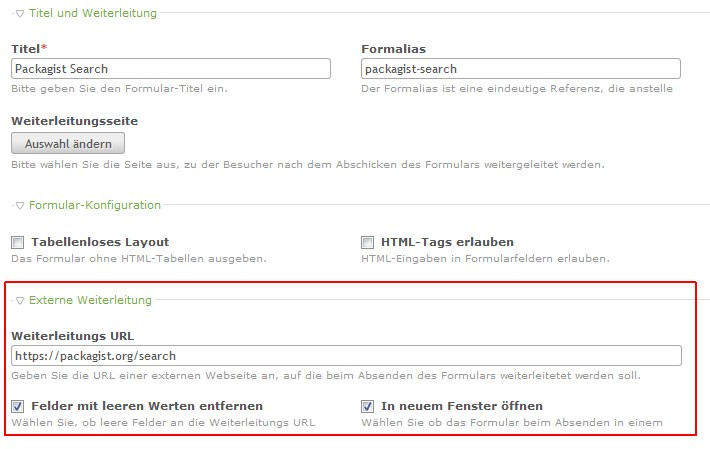

Contao Extension: FormExternalForwarding
========================================

Offers the possibility for forms to define an external URL as forwarding destination.

Installation
------------

Install the extension via composer: [cliffparnitzky/form-external-forwarding](https://packagist.org/packages/cliffparnitzky/form-external-forwarding).

If you prefer to install it manually, download the latest release here: https://github.com/cliffparnitzky/FormExternalForwarding/releases

Tracker
-------

https://github.com/cliffparnitzky/FormExternalForwarding/issues

Compatibility
-------------

- min. Contao version: >= 3.3.0
- max. Contao version: <  3.6.0

Dependency
----------

- There are no dependencies to other extensions, that have to be installed.

Screenshots
-----------

